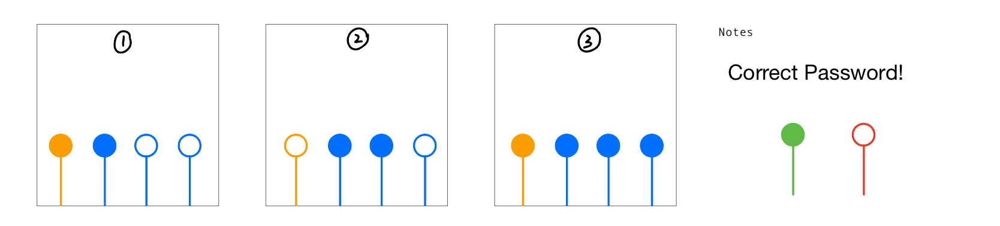
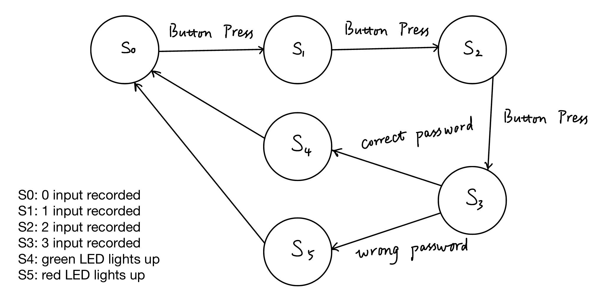
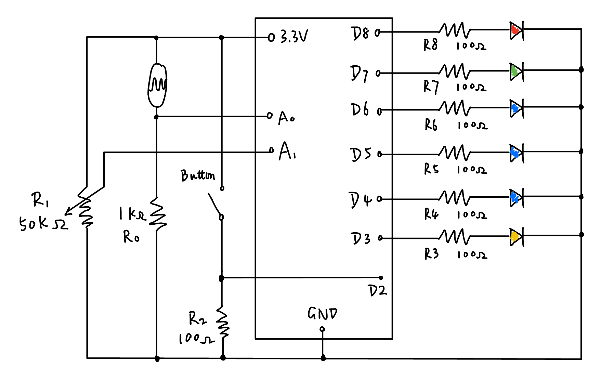

# HW11
 
This week's homework is to create a password machine. I used a potentiometer, a photoresistor, and a button for password input. 

## Ideation
In my password machine, the potentiometer controls 3 blue LEDs and the photoresistor controls 1 yellow LED. As I turn the potentiometer from very left to very right, the 3 blue LEDs light up one by one. The yellow LED turns on when the photoresistor is not exposed to strong enough light. 

Each button press will input a password into the system. Upon 3 button presses, the password machine will validate the password sequence. If the sequence is correct, the green LED will light up. Else, the red LED will light up. Below is the password sequence I designed: 

* Turn on the yellow LED. Turn on the 1st blue LED. Press the button. 
* Turn off the yellow LED. Turn on the 1st and 2nd blue LEDs. Press the button.
* Turn on the yellow LED. Turn on all the blue LEDs. Press the button.

Below is the Finite State Machine of my password machine. 

Below is the Circuit Diagram of my password machine. 

## Implementation

## Circuit Images

  
&nbsp; &nbsp; &nbsp; &nbsp;
  

  
&nbsp; &nbsp; &nbsp; &nbsp;
  

  

## Video

      

